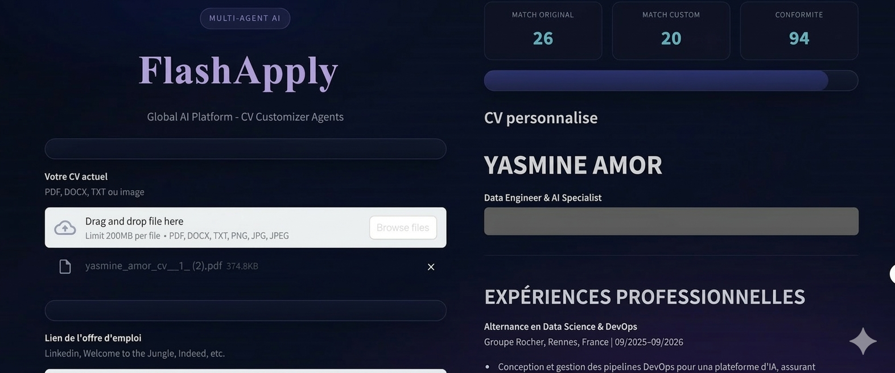
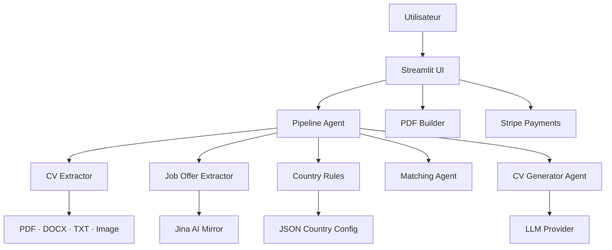
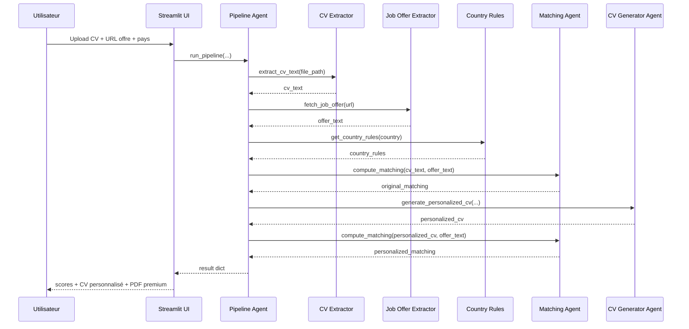

<div align="center">

<br/>

# ⚡ FlashApply

### AI-powered CV personalisation — tailored to every job offer, every country.

<br/>

[](https://python.org)
[](https://streamlit.io)
[](https://fastapi.tiangolo.com)
[](https://deepseek.com)
[](https://stripe.com)

<br/>

> Upload your CV · Paste a job URL · Pick a country · Get a perfectly matched CV in seconds.

<br/>

</div>

---

## 🗺️ Table of Contents

- [What is FlashApply?](#-what-is-flashapply)
- [Features](#-features)
- [Interface](#-interface)
- [Scores explained](#-scores-explained)
- [Premium model](#-premium-model)
- [Architecture](#-architecture)
- [Project structure](#-project-structure)
- [Components](#-components)
- [External services](#-external-services)
- [Data contracts](#-data-contracts)

---

## 🎯 What is FlashApply?

FlashApply is a **Streamlit application** that helps you adapt your CV to any job offer — automatically.

It analyses the gap between your CV and a target role, rewrites it using an LLM, and ensures the result conforms to the hiring norms of the target country. The full PDF export is unlocked via a one-time Stripe payment. Everything else is free to preview.

---

## ✨ Features

| | Feature | Description |
|---|---|---|
| 📄 | **CV Import** | Upload PDF, DOCX, TXT, or image — OCR supported |
| 🔗 | **Job Offer Parsing** | Paste any job URL — text is extracted automatically via Jina AI |
| 🌍 | **Country Targeting** | Adapts formatting and tone for France 🇫🇷, Germany 🇩🇪, Canada 🇨🇦 |
| 📊 | **Match Scoring** | Before/after keyword match score + country compliance score |
| 🤖 | **LLM Rewriting** | CV regenerated with DeepSeek-V3.2 reasoning (thinking) mode |
| 💳 | **Stripe Premium** | PDF download unlocked after a single payment — no account needed |

---

## 🖥️ Interface

The Streamlit UI is split into two panels:



```
┌───────────────────────────┬─────────────────────────────────┐
│         LEFT PANEL        │          RIGHT PANEL            │
│                           │                                 │
│  ① Upload CV              │  ④ Match Original score         │
│  ② Paste job offer URL    │  ⑤ Match Custom score           │
│  ③ Select target country  │  ⑥ Conformité score             │
│                           │  ⑦ Personalised CV preview      │
│  [ Run Analysis ]         │  ⑧ PDF download  (premium 🔒)   │
│  [ Generate Stripe Link ] │                                 │
└───────────────────────────┴─────────────────────────────────┘
```

**Supported CV formats:** `PDF` · `DOCX` · `TXT` · `Image (OCR)`

---

## 📊 Scores Explained

### `Match Original` — how good is your CV *before* personalisation?

Keywords are extracted from the job offer. This score measures how many of them already appear in your original CV. A low score means the offer's vocabulary is barely reflected in your current document.

### `Match Custom` — how good is your CV *after* personalisation?

Same calculation, run on the rewritten CV. A higher score than `Match Original` confirms the LLM successfully aligned your CV with the offer's language and expectations.

### `Conformité` — does your CV fit the target country?

This score does **not** compare your CV to the job offer. It checks against cultural rules specific to the selected country: section order, personal information policies, tone, and layout expectations.

**Scoring formula:**

```
match_score = (keywords found in CV ÷ total keywords detected) × 100
```

---

## 💳 Premium Model

```
┌────────────────────────────────────────────────────────────┐
│  FREE tier                      PREMIUM tier               │
│                                                            │
│  ✅ Upload CV                   ✅ Everything in FREE      │
│  ✅ Fetch & parse job offer     ✅ Download final PDF       │
│  ✅ Run full analysis                                      │
│  ✅ View personalised CV                                   │
│  ✅ See all three scores                                   │
│  ❌ Download PDF export                                    │
└────────────────────────────────────────────────────────────┘
```

**Payment flow:**

```
User clicks "Generate Stripe Link"
        ↓
Completes payment on Stripe checkout
        ↓
Stripe redirects → app/?payment=success
        ↓
App activates premium mode
        ↓
PDF download button appears ✅
```

---

## 🏗️ Architecture

### Pipeline overview



### Execution sequence



---

## 📁 Project Structure

```
FlashApply/
├── streamlit_app.py                    # Main Streamlit UI & pipeline entrypoint
├── ARCHITECTURE.md
├── README.md
├── requirements.txt
│
└── app/
    ├── main.py                         # Minimal FastAPI backend (health check)
    │
    ├── config/
    │   └── cv_customizer_agent.json    # Country profiles — FR · DE · CA
    │
    ├── agents/
    │   ├── pipeline_agent.py           # Core business orchestration
    │   ├── matching_agent.py           # Keyword-based scoring
    │   └── cv_generator_agent.py       # LLM CV generation + rule-based fallback
    │
    ├── extractors/
    │   ├── cv_extractor.py             # PDF · DOCX · TXT · OCR dispatcher
    │   └── job_offer_extractor.py      # URL → text via Jina AI
    │
    └── utils/
        ├── country_rules.py            # Country norm adapter
        ├── llm.py                      # DeepSeek / OpenAI connector
        └── stripe_payments.py          # Stripe payment link creator
```

---

## 🧩 Components

### 🎨 Presentation — `streamlit_app.py`

The single entry point for all user interaction.

- Collects CV file, job offer URL, and target country
- Manages Streamlit session state across steps
- Triggers `run_pipeline` and renders all results
- Generates the premium PDF from the personalised markdown
- Creates a Stripe payment link and unlocks PDF download on `?payment=success`

---

### ⚙️ Orchestration — `pipeline_agent.py`

The central application service. Chains every step in order:

```
extract CV text
    → fetch job offer
        → load country rules
            → score original CV
                → generate personalised CV
                    → score personalised CV
                        → compute compliance
                            → return result dict
```

---

### 📂 Extraction

| Module | Input | Method |
|---|---|---|
| `cv_extractor.py` | `.pdf` | `pdfplumber` |
| `cv_extractor.py` | `.docx` | `python-docx` |
| `cv_extractor.py` | `.txt` | Direct read |
| `cv_extractor.py` | Image | `pytesseract` OCR |
| `job_offer_extractor.py` | Any URL | `https://r.jina.ai/{url}` |

---

### 🤖 CV Generator — `cv_generator_agent.py`

Generates the personalised CV using:

- 📋 Country formatting rules
- 📈 Current match score
- 🔑 Present / missing keywords
- 📄 Source CV text + job offer text

Falls back to a **rule-based mode** if no LLM API key is available.

---

### 🌍 Country Profiles — `cv_customizer_agent.json`

Each profile defines document length, layout type, allowed/forbidden personal info, section order, tone, and cultural constraints.

| Country | Key rules |
|---|---|
| 🇫🇷 **France** | Formal tone · photo optional · structured sections |
| 🇩🇪 **Germany** | Lebenslauf format · photo expected · strict chronology |
| 🇨🇦 **Canada** | No photo · concise · skills-first · bilingual considerations |

---

## 🔌 External Services

### LLM — `llm.py`

Provider resolution order:

```
1. DeepSeek   →   DEEPSEEK_API_KEY      deepseek-reasoner  (V3.2 thinking mode)
2. OpenAI     →   OPENAI_API_KEY        fallback only
```

> `deepseek-reasoner` is the **DeepSeek-V3.2 "thinking" mode** — extended chain-of-thought reasoning before generating the final CV. Custom base URL is supported via `DEEPSEEK_BASE_URL` (defaults to `https://api.deepseek.com`).

---

### 💳 Stripe — `stripe_payments.py`

Creates per-session, on-the-fly:

```
Product  →  Price  →  Payment Link  →  Redirect to ?payment=success
```

No stored products, no subscriptions — each session generates its own Stripe artefacts.

---

### 📦 Local Dependencies

| Package | Used for |
|---|---|
| `pdfplumber` | PDF text extraction |
| `python-docx` | DOCX parsing |
| `pytesseract` | Image OCR |
| `Pillow` | Image pre-processing |
| `reportlab` | PDF generation |
| `streamlit` | UI framework |
| `fastapi` | Backend health endpoint |
| `langchain-openai` | LLM client (DeepSeek-compatible) |
| `stripe` | Payment link creation |

---

## 🔄 Data Contracts

**Pipeline input:**
```python
{
  "cv_file_path": "local_temp_path",   # Temporary path of uploaded CV
  "offer_url":    "https://...",        # Job offer URL
  "country":      "France"             # Target country profile
}
```

**Pipeline output:**
```python
{
  "country":               "...",      # Selected country
  "country_rules":         { ... },    # Loaded formatting rules
  "cv_text":               "...",      # Extracted CV text
  "offer_text":            "...",      # Extracted job offer text
  "original_matching":     { ... },    # Score before personalisation
  "personalized_cv":       "...",      # LLM-generated CV
  "personalized_matching": { ... },    # Score after personalisation
  "compliance":            { ... }     # Country conformity score
}
```

---

<div align="center">

<br/>

**FlashApply** · AI CV Personalisation · Streamlit + DeepSeek + Stripe

<br/>

*Not financial or legal advice. CV quality depends on LLM output.*

</div>
